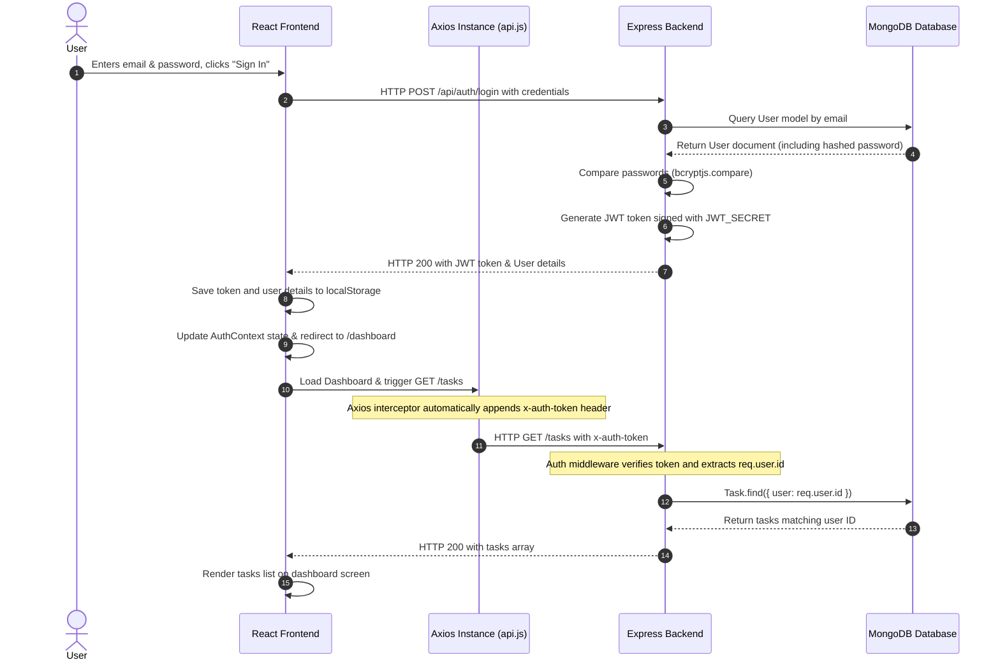

# Study Planner - Project Flow & MERN Stack Q&A Guide

This guide provides a detailed flow of the Study Planner application, followed by conceptual and project-specific questions and answers to help you understand and explain the codebase (ideal for presentations, exams, or viva).

---

## 1. Step-by-Step Project Flow

The diagram and text below describe exactly what happens when a user interacts with the application.



### Steps in Detail:
1.  **Authentication & Storage**:
    *   The user submits login details on the `/login` page.
    *   The frontend sends a request to the backend. The backend matches the email, compares passwords securely, creates a JWT (JSON Web Token), and sends it back.
    *   The frontend receives the token and stores it in `localStorage`.
2.  **Request Interception**:
    *   Every time the React app makes an API request (e.g., fetching tasks), an **Axios Interceptor** automatically reads the token from `localStorage` and appends it to the request headers (`x-auth-token` and `Authorization`).
3.  **Backend Security Middleware**:
    *   The backend receives the request. Before reaching the route handler, the `auth` middleware intercepts the request, verifies the token signature using the secret key (`JWT_SECRET`), extracts the user's ID, and attaches it to `req.user`.
4.  **Database Scoping**:
    *   The task controller runs database queries matching only the logged-in user (`Task.find({ user: req.user.id })`).
    *   MongoDB returns only that user's tasks, preventing data leaks.

---

## 2. Core MERN Stack Q&A

### Q1: What does MERN stand for?
**Answer:**
*   **M**ongoDB: A NoSQL Document Database used to store application data in BSON (binary JSON) format.
*   **E**xpress.js: A minimal and flexible Node.js web application framework used to build backend REST APIs.
*   **R**eact.js: A frontend JavaScript library used for building dynamic, interactive user interfaces.
*   **N**ode.js: A JavaScript runtime environment that executes JavaScript code outside a web browser (on the server).

### Q2: What is the difference between SQL and NoSQL databases, and why do we use MongoDB?
**Answer:**
*   **SQL Databases** (like MySQL, PostgreSQL) are relational, table-based, and require a strict, predefined schema.
*   **NoSQL Databases** (like MongoDB) are non-relational, document-based, and schema-less.
*   **Why MongoDB?** MongoDB stores data in flexible JSON-like documents, which map naturally to JavaScript objects in a MERN stack. It handles unstructured data easily, scales horizontally, and makes rapid prototyping much faster.

### Q3: What is Mongoose and why is it used instead of raw MongoDB queries?
**Answer:**
Mongoose is an **ODM** (Object Document Mapper) library for MongoDB and Node.js. It is used because:
*   It defines structural schemas for collections (types, defaults, validators).
*   It provides built-in validation (e.g., making fields `required` or setting `enum` choices).
*   It simplifies query building and establishes model relationships (like matching a Task to a User).

### Q4: What is JWT (JSON Web Token) and how does it work in session management?
**Answer:**
JWT is an open standard used to securely transmit information between parties as a JSON object.
*   **Structure:** It has three parts separated by dots: `Header.Payload.Signature`.
*   **How it works:** When a user logs in, the server generates a token signed with a private secret key. The client receives this token and stores it. For subsequent requests, the client sends this token. The server verifies the signature to validate the session.
*   **Benefit:** It is stateless, meaning the server doesn't need to keep session records in memory, making the application easily scalable.

### Q5: What is CORS (Cross-Origin Resource Sharing) and why is it needed?
**Answer:**
CORS is a browser security mechanism that restricts resources on a web page from being requested from another domain outside the domain from which the first resource was served.
*   **Why needed:** Our React app runs on port `5173` (origin A) and tries to request resources from our Express server on port `5000` (origin B). Without configuring the `cors` middleware in Express, the browser would block this request to prevent malicious cross-origin data theft.

---

## 3. Project-Specific Q&A

### Q1: How did you implement the User-Task relationship in the database?
**Answer:**
Inside **[Task.js](file:///c:/Users/Upadh/OneDrive/Desktop/Project-MERN/backend/models/Task.js)**, we added a `user` field that stores the MongoDB `ObjectId` of the User who created it:
```javascript
user: {
  type: mongoose.Schema.Types.ObjectId,
  ref: "User",
  required: true
}
```
In **[taskRoutes.js](file:///c:/Users/Upadh/OneDrive/Desktop/Project-MERN/backend/routes/taskRoutes.js)**, when a task is created, we assign `user: req.user.id`, and when fetching tasks, we query `Task.find({ user: req.user.id })`.

### Q2: What is the purpose of the Axios Request Interceptor in `api.js`?
**Answer:**
Instead of manually reading the token and appending auth headers to every single API request in all our components, we configured a central interceptor in **[api.js](file:///c:/Users/Upadh/OneDrive/Desktop/Project-MERN/frontend/src/api.js)**:
```javascript
api.interceptors.request.use((config) => {
  const token = localStorage.getItem("token");
  if (token) {
    config.headers["x-auth-token"] = token;
    config.headers["Authorization"] = `Bearer ${token}`;
  }
  return config;
});
```
This automatically secures every HTTP request sent through our `api` client without code repetition.

### Q3: Why did you remove Tailwind CSS and how is the styling managed now?
**Answer:**
*   **Why removed:** The original planner pages used custom Vanilla CSS styles defined in `style.css`, whereas the authentication page templates were using Tailwind CSS utility classes. Since Tailwind was not configured or compiled in the project, the pages looked completely unstyled.
*   **How managed:** We migrated all pages to use the existing styles in **[style.css](file:///c:/Users/Upadh/OneDrive/Desktop/Project-MERN/frontend/src/style.css)**. This kept the design consistent, avoided installing unnecessary npm packages, reduced file size, and maintained a premium look.

### Q4: How does Protected Routing work in the frontend?
**Answer:**
We created a custom component called `ProtectedRoute` in **[App.jsx](file:///c:/Users/Upadh/OneDrive/Desktop/Project-MERN/frontend/src/App.jsx)**.
*   It reads `user` and `loading` states from `AuthContext`.
*   If the session is still loading, it shows a loading message.
*   If `user` is null (not logged in), it redirects the browser to `/login` using React Router's `<Navigate to="/login" replace />`.
*   If the user is logged in, it allows the rendering of the child pages (`Dashboard`, `Planner`, `AllTasks`).

### Q5: What was the cause of the React is not defined error and how was it fixed?
**Answer:**
*   **Cause:** Some files returned JSX elements but did not import the `React` library. In certain bundlers or dev servers, JSX tags compile to `React.createElement(...)`. Since `React` was not in scope, the browser console threw a ReferenceError, rendering a blank screen.
*   **Fix:** Added `import React from 'react';` to the top of `AuthContext.jsx`, `Login.jsx`, `Register.jsx`, and `Dashboard.jsx`.
